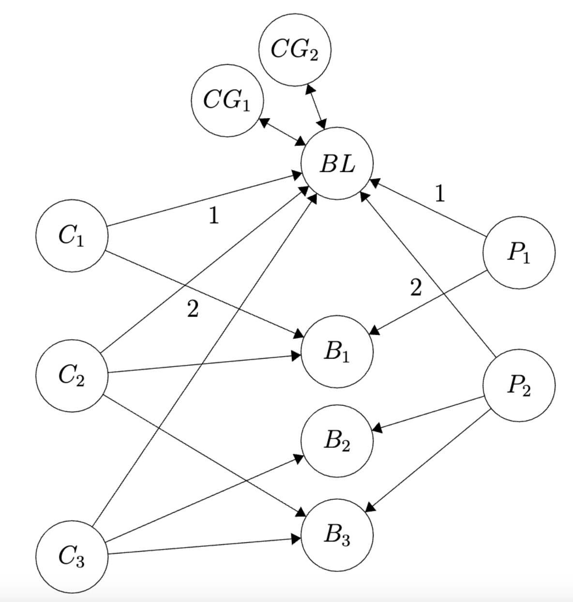

# Comanche Franz

## An attempt at a Kafka client + cluster manager in Rust

#### [NOTE] Much work was doing using VSCode's Live Share feature, so the commit history is not an accurate representation of the work done.

Welcome to our final project! Here is a list of the key feature in this project, and the structure of our Kafka service.

First of all, the service is split into the following parts:
- Broker Leader
- Broker
- Producer
- Consumer
- Consumer Group

The broker leader is responsible for coordinating all of the other brokers/partitions, and it also assigns the partitions and sends this info out.

The process for the Producer is explained as follows: When a new Producer is created, it sends a request to the Broker Leader. When a topic is first created (which has to be done on a Producer), it is sent to the Broker Leader, which responds with which partitions and brokers this topic is assigned to. Then, when a Producer sends a message to a topic, it reaches out directly to the broker responsible for the partitions of that topic. The broker then handles this, which will be described later.

When a Consumer is first created, it sends a request to the Broker Leader. Then, a Consumer MUST join a Consumer Group. The Broker Leader keeps track of which consumers are in which group (and sends this information back to the Consumer). Each message in a topic will only get sent to (at most) one consumer in a group. Then, when a Consumer subscribes to a topic, it reaches out to the Broker Leader to inform of the subscription. The Broker Leader then responds with which brokers are responsible for the partitions of that topic.

When a consumer polls for the most recent message in the stream, it reaches out to the broker leader to determine if the partition distribution has been updated (i.e. consumers have been added/removed from its consumer group). Then, it directly to a broker responsible for one of the partitions it consumes from. Note that a Consumer only recieves the messages since it subscribed to the topic.

When a Broker recieves a message from the Producer (multiple brokers could have this due to the partitions for the topic), it writes the message to file and stores an offset of the current position. ADD MORE HERE

Here is a diagram demonstrating what parts talk to what:

To explain some of the features included in our Kafka implementation, the number of brokers is scalable (as well as the number of partitions per topic). These are constants set at the begining of the program, but in the future we could make this more robust by having the Broker Leader ping the Brokers for a heartbeat. If the Broker Leader finds that a Broker isn't responding, it could remove that Broker and create a new one to take over its responsibilties. This would improve the fault tolerance of the system greatly.

To run Kafka, first start (one or more) Broker(s) by running `cargo run -- broker` (you may have to pass in the port to distinguish the brokers). Then run the Broker Leader by running `cargo run -- brokerlead`. Now to use Kafka, it can actually be done through command line arguments, or there are tests that also demonstrate how it could be used in another Rust program (to be explained later). To use command line, a new Producer can be made with `cargo run -- producer`. This then starts up a producer with clear instructions on its use (e.g. adding a topic and writing a message to that topic). To run a Consumer, run `cargo run -- consumer`, and again this has clear instructions on how to use it (e.g. subscribing/unsubscribing and polling for messages).

Additionally, there are some tests added that test the system. These demonstrate how one might use Kafka in another Rust program. Initially, there is a function that starts up Kafka (running the broker leader and some set number of brokers). After that, the user can initialize a Producer (or multiple), and a Consumer (or multiple). Then they can use the provided functions (listed below) to read and subscribe.

Producer API:
- new(broker_leader_addr: ServerId) -> Producer
- add_topic(&mut self, topic: Topic) -> Result<(), reqwest::Error>
- remove_topic(&mut self, topic: Topic) -> Result<(), reqwest::Error>
- send_message(&mut self, topic: Topic, value: Value) -> Result<(), reqwest::Error>

Consumer API:
- new(addr: ServerId, broker_leader_addr: ServerId) -> Consumer
- subscribe(&mut self, topic: Topic) -> Result<(), reqwest::Error>
- unsubscribe(&mut self, topic: Topic) -> Result<(), reqwest::Error>
- join_consumer_group(&mut self, consumer_group_id: ConsumerGroupId) -> Result<(), reqwest::Error>
- leave_consumer_group(&mut self) -> Result<(), reqwest::Error>
- poll(&mut self) -> Result<Vec<Value>, reqwest::Error>
